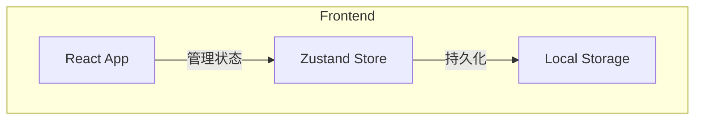
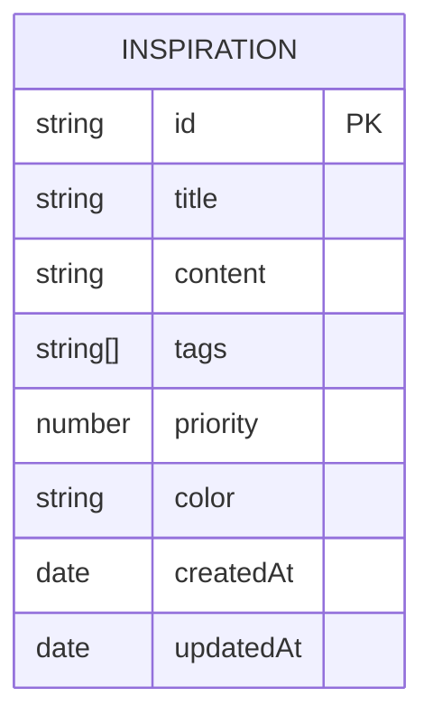

## 1. Architecture Design


## 2. Technology Description
- Frontend: React@18 + TypeScript + tailwindcss@3 + vite
- Initialization Tool: vite-init
- State Management: Zustand
- Data Persistence: LocalStorage
- Icons: lucide-react

## 3. Route Definitions
| Route | Purpose |
|-------|---------|
| / | 主页面 - 灵感列表 |
| /create | 创建灵感页面 |
| /edit/:id | 编辑灵感页面 |
| /detail/:id | 灵感详情页面 |

## 6. Data Model
### 6.1 Data Model Definition


### 6.2 Data Definition (TypeScript Interface)
```typescript
interface Inspiration {
  id: string;
  title: string;
  content: string;
  tags: string[];
  priority: 1 | 2 | 3 | 4 | 5;
  color: string;
  createdAt: Date;
  updatedAt: Date;
}
```
