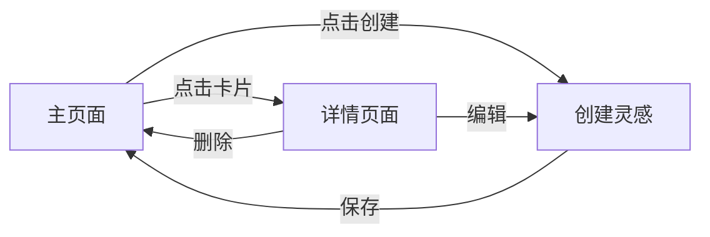

## 1. Product Overview
灵感记录网站是一个简洁优雅的应用，帮助用户随时捕捉、保存和管理创意想法与灵感。
- 面向创意工作者、学生和任何需要记录突发灵感的用户
- 提供快速记录、标签分类、搜索筛选和美观展示功能

## 2. Core Features

### 2.1 Feature Module
1. **主页面**：灵感列表展示、快速创建按钮、搜索和筛选
2. **创建/编辑页面**：灵感编辑界面，支持富文本、标签、优先级设置
3. **详情页面**：灵感详情查看、分享、删除功能

### 2.3 Page Details
| Page Name | Module Name | Feature description |
|-----------|-------------|---------------------|
| 主页面 | 灵感列表 | 卡片式展示，按时间倒序排列，支持筛选和搜索 |
| 主页面 | 快速创建 | 浮动按钮，点击打开创建面板 |
| 创建/编辑页面 | 编辑表单 | 支持标题、内容、标签、优先级、颜色标记 |
| 详情页面 | 详情展示 | 完整展示灵感内容，支持编辑和删除 |

## 3. Core Process
用户打开应用 → 浏览已有灵感或搜索 → 点击快速创建按钮 → 填写灵感内容 → 保存 → 在列表中查看 → 可随时编辑或删除

## 4. User Interface Design
### 4.1 Design Style
- 主色调：温暖的橙色渐变 (#FF6B35 → #F7C59F)，象征创意与活力
- 辅助色：柔和的蓝色 (#2EC4B6) 和紫色 (#9B5DE5)
- 按钮风格：圆角矩形，带有微妙阴影和悬停效果
- 字体：标题使用 Playfair Display，正文使用 Inter
- 布局风格：卡片网格布局，温暖的米色背景
- 图标：简约线性图标，来自 Lucide React

### 4.2 Page Design Overview
| Page Name | Module Name | UI Elements |
|-----------|-------------|-------------|
| 主页面 | 灵感卡片 | 柔和阴影，渐变背景，圆角设计，悬停放大效果 |
| 主页面 | 顶部导航 | 简洁标题，搜索框，筛选按钮 |
| 创建页面 | 表单 | 干净的输入区域，标签选择器，优先级滑块 |
| 详情页面 | 内容展示 | 大字体标题，优雅的排版，柔和的动画 |

### 4.3 Responsiveness
桌面优先设计，完全响应式适配移动端和平板设备，触摸操作优化。
